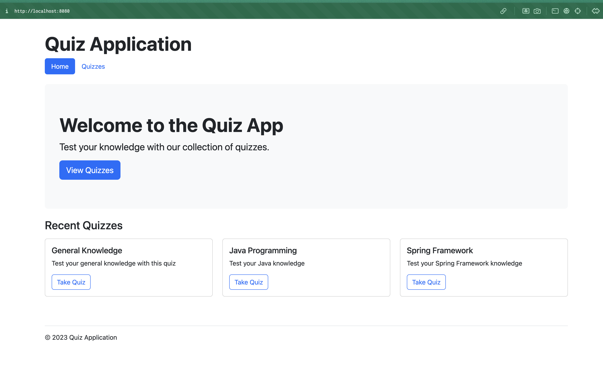
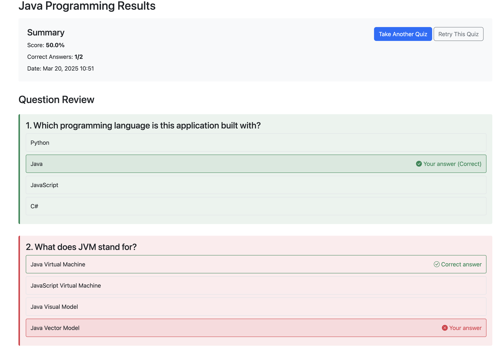

# Negative:
-  Was quite slow
* First try running gradle failed because of use of deprecated code
* Sometimes got stuck overthinking the same thing
* Can create quiz but can't add questions to it (but it doesn't break the app, it the quiz just has 0 questions)
* Created an embbedded class in the same file as another class
* No Swagger api docs(even though it did it for another project), no docstrings, or tests
* No example requests for the API docs

# Positive:
- It goes back through the files it already created to modify them if needed
- It tries to run the system from the command line
- It tries to find solutions if things fail in commands sent by it (without being prompted to do so)
- Created a html files for frontend (even though it wasn't asked). Check Frontend.
- Mostly readable and understandable code.
- Set up data to autofill the DB at server start
- Good separation of concerns (different controllers and services for each type of data)
- Good documentation with future improvements ideas
- Used Jakarta for DB compatibility and used annotations from it

## Frontend: 
* Actually very impressed with how it looks:)

# Overall
I was quite impressed with what it did. I did not expect a frontend or usage of more libraries than asked. Sometimes it could have improved (e.g. not using lombok) or functionality was not working the first time, but tweaking some rules could improve that. But I do like that it tries things out to make sure they are working before saying it finished.